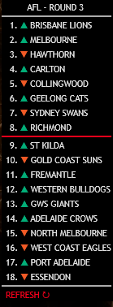

# A Simple AFL Ladder for Rainmeter

When loaded it will check the current Australian Rules Football League (AFL) Ladder and list the current 18 teams in order.

A line is also generated to divide the top 8 from the bottom 10 as only the top 8 go on to finals.

## Install

Download the lastest version of Rainmeter - <https://www.rainmeter.net/>

Download the skin package from <https://github.com/minusInfinite/rainmeter-afl-ladder/releases>

## Possible Improvements

- [X] Position Change from last Round
- [ ] Points
- [ ] Win/Loss
- [ ] Next Match
- [ ] Team Colours/Logos

## Change Log

1.0.1 - Fixed changed URL for the main WebParser as the direct ladder URL no longer generates the needed data when Javascript is not available.
